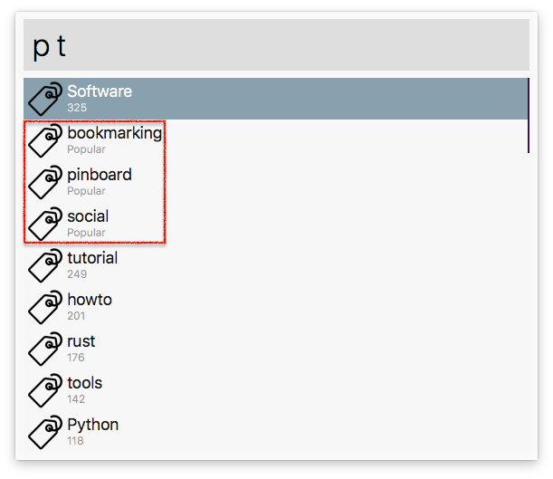
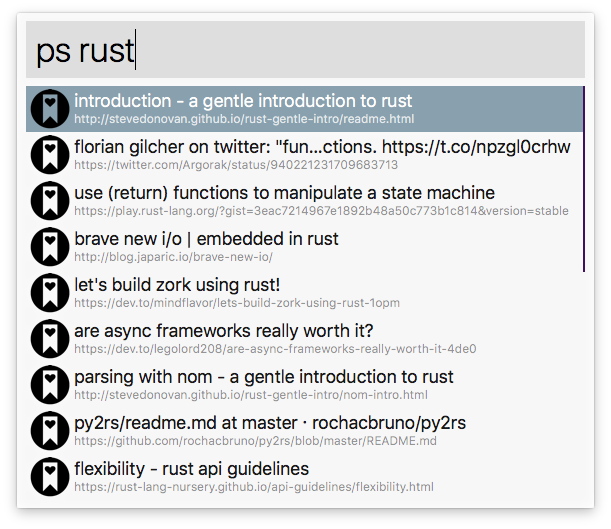
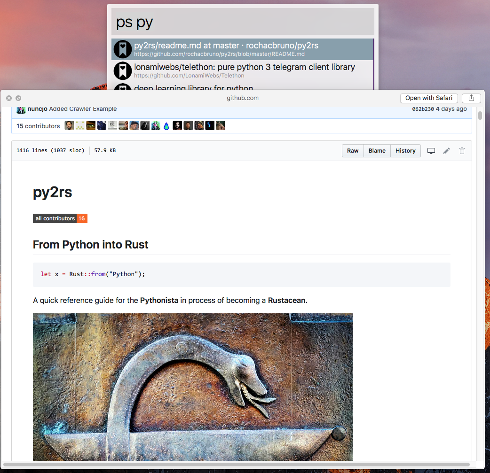
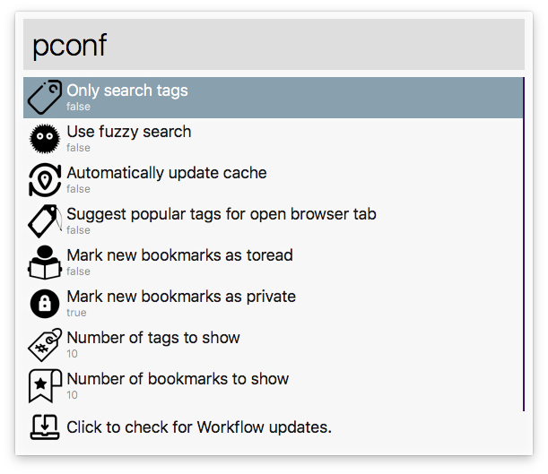
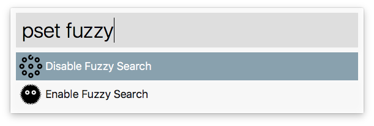
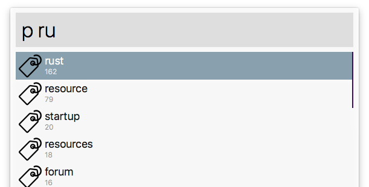
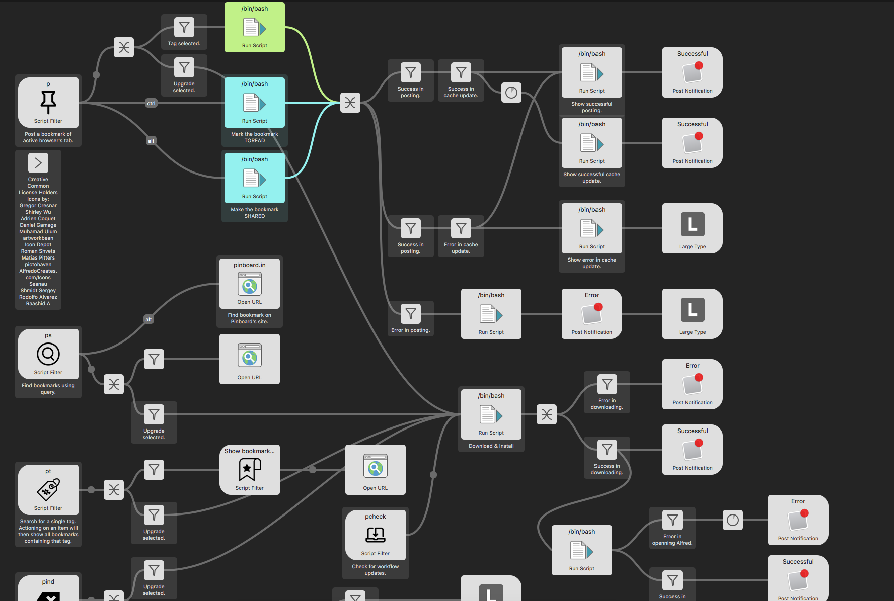

# Alfred Workflow for Pinboard

Manage, post and **preview** your bookmarks on [Pinboard](https://pinboard.in) right from within [Alfred app](https://www.alfredapp.com).
## Features
Pinboard is a great and reliable bookmarking service. Its [front page](https://pinboard.in) sums it all:
"**Social Bookmarking for Introverts. Pinboard is a fast, no-nonsense bookmarking site.**"

This plugin will let you:

- _**post**_ a bookmark to Pinboard right from Alfred, with:
  - Fetching bookmark information from active browser's window
  - _tag_ auto-completion to show your current tags.
  - _popular_ tags for the current _url_
  - and more ...
- _**search**_ your current bookmarks
  - Tap <kbd>Shit</kbd> to show a preview of selected item without opening browser.
  - Tap <kbd>Command+L</kbd> to show _Large_ toast of title
  - Tap <kbd>Command</kbd> to show current item's _tags_
  - Tap <kbd>Control</kbd> to show current item's extended notes/descriptioin.
- Many options that can be easily adjusted. (see below)

For posting you just need to enter the Workflow's keyword ( `p` ) into Alfred's window and follow it with couple of tags and an optional description. The workflow will then post a bookmark for the window/tab of the active browser to Pinboard.

### Supported Browsers:
- Safari
- Chromium
- Firefox
- Chrome
- Vivaldi
- Firefox Dev. Edition
- Safari Tech. Preview

For searching, use ( `ps` ) and then type the search keywords.

## Installation / Setup
After [downloading](https://github.com/spamwax/alfred-pinboard-rs/releases/latest) the latest version of the workflow and installing it in Alfred, you need to do a one-time setup to authenticate the Workflow. This Workflow only uses username/token method so you won't need to enter your password. (This is the *suggested* way of using Pinboard's API).
If you don't have a token, get one from Pinbaord's [setting's page](https://pinboard.in/settings/password).

Then invoke Alfred and enter your username:token after the ***"pa"*** keyword:


This workflow will keep a local cache of the tags and bookmarks that you have in Pinboard.

To manually update the cache, you need to issue the ***`pu`*** command:


---

## Usage (post a bookmark):
The syntax to post a bookmark to Pinboard is :

```
p tag1 tag2 tag3 ; some optional note
```

The workflow will show a list of your current tags as you are typing:


The number below each tag shows how many times you have used it in Pinboard bookmarks.
You can move Alfred's highlighter to the desired tag and hit '**Tab**' to **autocomplete** it.

To finish the process just press Enter.

- If tag suggestion feature is enabled (see `pset seggess_tags`), 3 popular tags based on current active webpage will be added to the list of your tags. The list is fetched from Pinboard's API and is often helpful. However this feature will add a 1 second delay to showing the tag list after first keystroke. This delay is disabled for consequent keystrokes as the fetched popular tags are cached. 

#### Modifiers (<kbd>Control ⌃, Option ⌥</kbd>)
You can hold down modifiers to one-time change some of your settings:

- <kbd>Control ⌃</kbd> : will mark the bookmark as `toread` (regardless of settings)
- <kbd>Option ⌥</kbd> : will mark the bookmark as `shared` (regardless of settings)

If you want to add extra description to the bookmark you can add it after a semi-colon:


## Usage (search bookmarks):
Searching your bookmarks is easy.

```
ps query1 query2 query3 ...
```

Workflow will use the text you enter in Alfred and show list of bookmarks that contain **all** of the search keywords in any of the bookmarks information (Desrciption of bookmark, its tags and url and its extended notes, search fields can be adjusted, see [settings](#config).

So **the more** search keywords you enter **the less** results will be displayed as it tries to find the bookmarks that contain ***all*** of the keywords.

The search result is ordered in descending order of dates they were posted to your Pinboard account.



#### Modifier keys (<kbd>Command ⌘, Control ⌃, Option ⌥</kbd>)
You can hold down modifiers to enable different behavior:

- <kbd>Control ⌃</kbd> : will show the extended description of selected bookmark.
- <kbd>Command ⌘</kbd> : will show tags of selected bookmark.
- <kbd>Option ⌥</kbd> : Holding `⌥` and pressing enter will open the bookmark in [Pinboard's website](https://pinboard.in).
- <kbd>Shift ⇧</kbd>: **Tap** ⇧ to load a preview of bookmark without opening your browser 😎 ⤵︎



## Usage (delete a bookmark):
To delete a bookmark, just make sure it is opened in your current broweser's window. Then use `pind`.


## Settings<a name="config"></a>

You can configure the behavior of workflow by entering `pconf` in Alfred:



Selecting each setting and hitting ⏎ (<kbd>Enter</kbd>) will let you adjust it:



On top of using `pconf`, you can directly type following commands to also adjust the settings:

- `pset fuzzy`: Enable/disable fuzzy search.
- `pset seggess_tags`: When posting a new bookmark, list popular tags for the active page. Note that this information is fetched from Pinboard and sometimes is not very _accurate_.
- `pset shared`: Mark all new bookmarks as _shared_.
- `pset toread`: Mark all new bookmarks as _toread_.
- `pset tagonly`: Only search within _tag_ field while doing any look-up.
- `pset auto`: After posting a new bookmark, automatically update the local cache.
- `pset tags`: Set number of tags to show: `pset tags 25`
- `pset bookmarks`: Set number of bookmarks to show: `pset bookmarks 12`

Most of configuration settings are self-explanatory.

- However `fuzzy` search may need a demo: When fuzzy search is enabled, the tags/bookmarks that contain the query letters in the given order are displayed:
 
  

  Otherwise, _normal_ search will search for consecutive characters in query:
  
  


## Misc.
- This workflow tries to show some helpful errors in different cases.


- If you want to change some behavior take a look at Alfred's workflow page:




## Known Issues
- Posting bookmark from Firefox while tag suggestions is enabled is broken. Alfred intercepts <kbd>Command-L</kbd> used in AppleScript to focus location bar of Firefox. This is needed to get url and other info out of Firefox. Unfortunately Firefox does not offer any better way of interacting with it from outside world programatically.

## TODO

I wish to add the following in the coming releases:

- ~~Let users delete a selected bookmark from witin Alfred.~~
- ~~Add a proper logging facility to Rust code.~~ (uses log_env)
- ~~Use a better error mechanism (maybe [failure](https://crates.io/crates/failure)?)~~


## Feedback / Bugs
This is my first non-trivial project using Rust language so so your [feedback or bug](https://github.com/spamwax/alfred-pinboard-rs/compare) reports are greatly appreciated.

## License
This open source software is licensed under [MIT License](./LICENSE.md).
